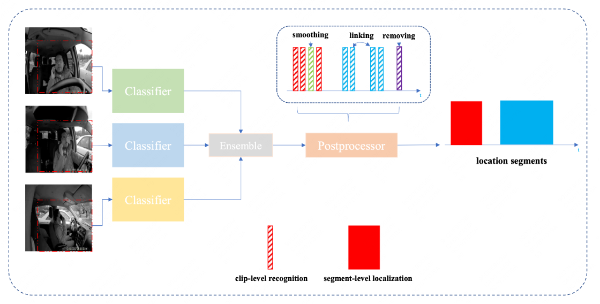

# Implementation of Multi view Action Recognition for Distracted Driver Behavior Localization

This repository is the official implementation of [Multi view Action Recognition for Distracted Driver Behavior Localization](paper/19.pdf).  This paper presents our approach for Track 3 (Natural- istic Driving Action Recognition) of the 2023 AI City Challenge, where the objective is to classify distracting driving activities in each untrimmed naturalistic driving video and localize the accurate temporal boundaries of them. We  rank the 1st on the Test-A2 of the challenge track.

## Requirements
Please follow the installation instructions in [VideoMAE](https://github.com/MCG-NJU/VideoMAE). Also, you can simply run the following command:
```
conda env create -f environment.yaml
conda activate pt1.9.0cu11.1_official
```

##  Data Preprocessing
**1. Data download**
Download the dataset from the offical website. Next, put "A1", "A2" split into folders "data/A1", "data/A2" respectively.   


**2. Action segments extraction**
Given the annotation file, we extract 16 distracted action classes from the video, which will be used as the recognition model training data. Run the following command:

```
python preprocess/extract_clips.py
```
and the video segments will be saved in folder "data/A1_clip".

**3. Generate K-Fold "train/val" split.**

```
python preprocess/split_k_fold.py
```


## Training Recognition Model
Our model is initialized with pretrained VideoMAE with  Kinetic-710, you can get the pretrained weights from [VideoMAE-Kinetic-710/ViT-L](https://drive.google.com/file/d/1jX1CiqxSkCfc94y8FRW1YGHy-GNvHCuD/view?usp=sharing) 
Modified the "MODEL_PATH" in script "scrpts/cls/train_cls.sh" to your own path.
To train the model (s) in the paper, run this command:

```train
bash sripts/cls/train_cls.sh
```

## Inference A2 video

To evaluate my model on test-A2, first download the pretrained weights in "[Model Zoo](#model-zoo)" section, and put them into the dir "aicity_released/checkpoints" . You will get a directory tree like this.
```
├── aicity_release
│   ├── checkpoints
│   │   ├── dash_0.pth
│   │   ├── dash_1.pth
│   │   └── ...
│   │   ├── dash_4.pth
│   │   ├── rearview_0.pth
│   │   ├── rearview_1.pth
│   │   └── ...
│   │   ├── rearview_4.pth
│   │   ├── rightside_0.pth
│   │   ├── rightside_1.pth
│   │   └── ...
│   │   ├── rightside_4.pth
│   ├── data
│   ├── figs
│   ├── paper
│   ├── pickles
```
 then run the following command:
```inference 
bash scripts/cls/inference_cls.sh 
```


## Postprocessing 

After inferencing the "test" set videos, we get the classification probablity sequence for each video. To get the final location results, we need to perform postprocessing on  
```
python run_submission.py
```
and a localization file will be generated as "aicity_released/A2_submission.txt"

## Customed Data (test-B)
For split "B", please organized them like the official released dataset like "A2". The format of the B dataset should be oragnized as follows:   

>   * B
>     * user_id_*
>       * CAMERAVIEW_user_id_*.MP4
>       * CAMERAVIEW_user_id_*.MP4
>       * CAMERAVIEW_user_id_*.MP4
>       * ...
>     * video_ids.csv   


Then run the following scripts, a localization txt file will be generated as "aicity_released/B_submission.txt".
```
bash localize_B.sh
python run_submission_B.py
```
## Model Zoo
We release our trained model weights organized with "camera view" and "fold k". You can download to reproduce the results we report in the paper.

| Camera View       | Fold | Model Results |
| ------------------ |---------------- | -------------- |
| Dashboard   |     0         |       [dash_0.pth](https://huggingface.co/idealweiwei/aicity_release/resolve/main/dash_0.pth)    |
| Dashboard   |     1         |       [dash_1.pth](https://huggingface.co/idealweiwei/aicity_release/resolve/main/dash_1.pth)    |
| Dashboard   |     2         |       [dash_2.pth](https://huggingface.co/idealweiwei/aicity_release/resolve/main/dash_2.pth)    |
| Dashboard   |     3         |       [dash_3.pth](https://huggingface.co/idealweiwei/aicity_release/resolve/main/dash_3.pth)    |
| Dashboard   |     4         |       [dash_4.pth](https://huggingface.co/idealweiwei/aicity_release/resolve/main/dash_4.pth)    |
| Rightside   |     0         |       [rightside_0.pth](https://huggingface.co/idealweiwei/aicity_release/resolve/main/rightside_0.pth)    |
| Rightside   |     1         |       [rightside_1.pth](https://huggingface.co/idealweiwei/aicity_release/resolve/main/rightside_1.pth)    |
| Rightside   |     2         |       [rightside_2.pth](https://huggingface.co/idealweiwei/aicity_release/resolve/main/rightside_2.pth)    |
| Rightside   |     3         |       [rightside_3.pth](https://huggingface.co/idealweiwei/aicity_release/resolve/main/rightside_3.pth)    |
| Rightside   |     4         |       [rightside_4.pth](https://huggingface.co/idealweiwei/aicity_release/resolve/main/rightside_4.pth)    |
| Rear View   |     0         |       [rearview_0.pth](https://huggingface.co/idealweiwei/aicity_release/resolve/main/rearview_0.pth)    |
| Rear View   |     1         |       [rearview_1.pth](https://huggingface.co/idealweiwei/aicity_release/resolve/main/rearview_1.pth)    |
| Rear View   |     2         |       [rearview_2.pth](https://huggingface.co/idealweiwei/aicity_release/resolve/main/rearview_2.pth)    |
| Rear View   |     3         |       [rearview_3.pth](https://huggingface.co/idealweiwei/aicity_release/resolve/main/rearview_3.pth)    |
| Rear View   |     4         |       [rearview_4.pth](https://huggingface.co/idealweiwei/aicity_release/resolve/main/rearview_4.pth)    |


## Contact
For further discussion, you are welcomed to send an e-mail to the following email address. 
zhouwei85@meituan.com ( or weizhou@hust.edu.cn)
qianyinlong@meituan.com